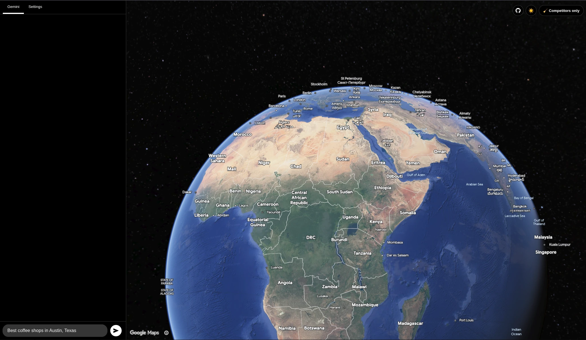
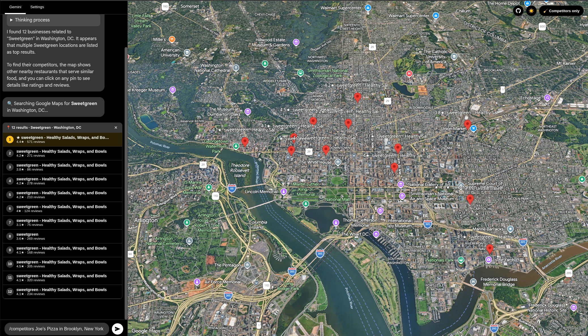
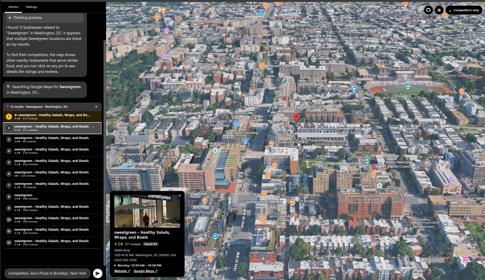
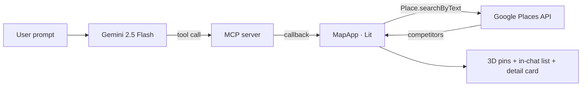

<div align="center">



# 🗺️ Local Competitor Map

### AI-powered local-competitor intelligence on a photorealistic 3D map.

Ask in plain English, like *"show me the top 10 plumbers in New York"*, and the
competitors appear as pins on Google's photoreal 3D globe, ranked with **ratings,
reviews and rich detail cards**. A **Gemini** agent drives it, talking to **Google
Places** through the **Model Context Protocol**.

### [▶ Try the live demo](https://agricidaniel.github.io/local-competitor-map/)

<sub>Bring your own Gemini and Google Maps keys; they stay in your browser.</sub>

<br/>

[](https://agricidaniel.github.io/local-competitor-map/)
[](https://github.com/AgriciDaniel/local-competitor-map/actions/workflows/ci.yml)
[](LICENSE)
[](https://www.typescriptlang.org/)
[](https://vitejs.dev/)
[](https://lit.dev/)
[](https://ai.google.dev/)
[](https://developers.google.com/maps/documentation/javascript/3d-maps-overview)

</div>

---

## ✨ What it does

**Local Competitor Map** turns a question into a map. You give it a business (or a
whole category) and a place. It finds the local competitive set, plots every result
on a photorealistic 3D map, and opens a Google-Maps-style detail card on click. A
conversational Gemini agent runs the whole flow.

- 🔍 **Natural-language search.** Ask *"who competes with Blue Bottle Coffee in San Francisco?"*, or run the deterministic `/competitors <business> in <city>` command.
- 📍 **Pins with ratings.** Every competitor is a 3D pin labelled with its star rating, and the business you searched for is highlighted.
- 🧾 **Rich detail cards.** A click shows the photo, rating, review count, category, address, phone, hours, website and a Google Maps link.
- 💬 **In-chat results list.** Competitors live right in the conversation. Click a row to fly the camera and pinpoint it.
- 🧹 **Declutter filter.** One click hides Google's place labels (parks, streets, unrelated businesses) so only your competitor pins remain.
- 🔑 **Bring your own keys.** Keys stay in your browser (Settings tab) or a gitignored local file. Nothing is hard-coded or committed.

---

## 📸 Screenshots

| Competitors plotted across the city | In-chat list and detail card |
| :---: | :---: |
|  |  |

---

## 🚀 Quick start

**Prerequisites:** [Node.js](https://nodejs.org/) 18+ and a Google account with the
Maps Platform and Gemini APIs enabled (see [Configuration](#-configuration)).

```bash
# 1. Clone
git clone https://github.com/AgriciDaniel/local-competitor-map.git
cd local-competitor-map

# 2. Install
npm install

# 3. Add your keys. Either run the app and paste them in the Settings tab,
#    or copy the example and fill it in (this file is gitignored):
cp runtime-keys.example.ts runtime-keys.ts

# 4. Run
npm run dev
```

Open the printed URL (for example `http://localhost:3000`).

---

## 🔑 Configuration

The app needs two credentials. Paste them into the in-app **Settings** tab (stored in
your browser's `localStorage`), or put them in `runtime-keys.ts`:

```ts
// runtime-keys.ts  (gitignored, never committed)
export const RUNTIME_KEYS = {
  geminiKey: 'YOUR_GEMINI_API_KEY',
  mapsKey: 'YOUR_GOOGLE_MAPS_API_KEY',
};
```

| Key | Where to get it | APIs to enable |
| --- | --- | --- |
| **Gemini API key** | [Google AI Studio](https://aistudio.google.com/apikey) | Generative Language API |
| **Google Maps key** | [Google Cloud Console](https://console.cloud.google.com/google/maps-apis) | **Maps JavaScript API**, **Places API (New)**, **Geocoding API**, **Directions API**, with **billing enabled** |

> 🔒 **Security.** Keys are used client-side only. `runtime-keys.ts`, `.env*` and
> `*.zip` are gitignored, and the bundled fallback key is empty by default, so no
> secret is ever committed.

---

## 🕹️ Usage

| You type | What happens |
| --- | --- |
| `show me the top 10 plumbers in New York` | Gemini routes to the competitor tool and plots them |
| `who competes with Sweetgreen in Washington, DC?` | Same, for a named business (highlighted as the client) |
| `/competitors Blue Bottle Coffee in San Francisco` | Deterministic slash command, no model call |
| `/competitors a gym in Austin, Texas for fitness` | The `<business> in <city> [for <keyword>]` grammar |

Then:

- **Click a list row or a pin.** The camera flies to it and a detail card opens.
- **Toggle "🧹 Competitors only"** (top-right). Google's labels disappear for a clean, competitor-only view.
- **Clear (✕)** on the results. The map resets.

---

## 🧠 How it works

A Lit web component renders the chat and the `<gmp-map-3d>` photorealistic map. The
Gemini agent receives the map tools over an **in-process MCP** transport. When it
calls `find_local_competitors`, the app queries the **Places API** and renders the
results.



| Layer | File |
| --- | --- |
| App entry, Gemini chat, MCP wiring | `index.tsx` |
| MCP server, tool definitions | `mcp_maps_server.ts` |
| UI, 3D map, competitor rendering | `map_app.ts` |
| Places competitor search | `places.ts` |
| Local key resolution | `settings.ts`, `runtime-keys.ts` |
| DataForSEO ranking layer (shelved) | `dataforseo.ts` |

---

## 🗂️ Project structure

```
.
├── index.html              # App shell + import map
├── index.tsx               # Entry: Gemini chat + MCP client/server wiring
├── map_app.ts              # Lit component: 3D map, chat, competitor UI, filter
├── mcp_maps_server.ts      # MCP tools the agent can call
├── places.ts               # Google Places competitor search
├── settings.ts             # Key resolution (localStorage then runtime-keys.ts)
├── runtime-keys.example.ts # Template for your local keys (copy to runtime-keys.ts)
├── dataforseo.ts           # Shelved: future local-SEO ranking layer
├── index.css               # Styles
└── vite.config.ts          # Vite config (plus dormant DataForSEO proxy)
```

---

## 🛣️ Roadmap

- [ ] **Organic competitors** panel (keyword and SERP overlap), as a second tab
- [ ] **Geo-grid rank heatmap** (true local-pack ranking via DataForSEO)
- [ ] **Granular POI filter** via a cloud Map style and Map ID (hide specific label types)
- [ ] Review and NAP intelligence in the detail card
- [ ] Optional one-click Google sign-in (Search Console and Business Profile)

---

## 🤝 Contributing

Contributions are welcome. Read [CONTRIBUTING.md](CONTRIBUTING.md) for the dev setup,
coding conventions, and how to open issues and pull requests.

---

## 📄 License

Licensed under the **Apache License 2.0**. See [LICENSE](LICENSE).

## 🙏 Acknowledgements

- Built on Google AI Studio's `mcp_maps_3d` sample.
- [Google Maps Platform · Photorealistic 3D Maps](https://developers.google.com/maps/documentation/javascript/3d-maps-overview), [Places API](https://developers.google.com/maps/documentation/places/web-service/op-overview), [Gemini API](https://ai.google.dev/), [Model Context Protocol](https://modelcontextprotocol.io/), [Lit](https://lit.dev/), [Vite](https://vitejs.dev/).

<div align="center">
<sub>Made with 🗺️ and 🤖</sub>
</div>
